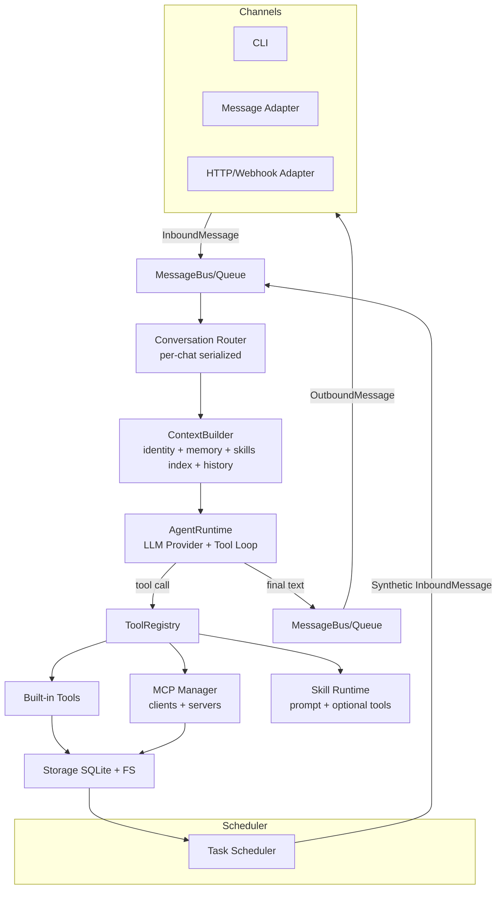
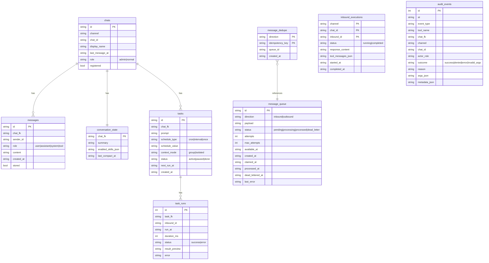
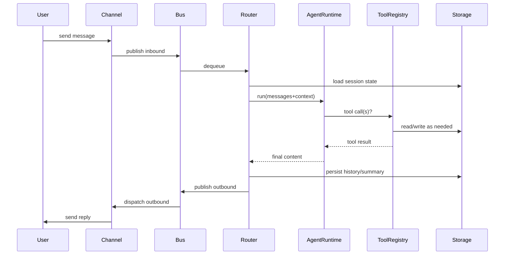
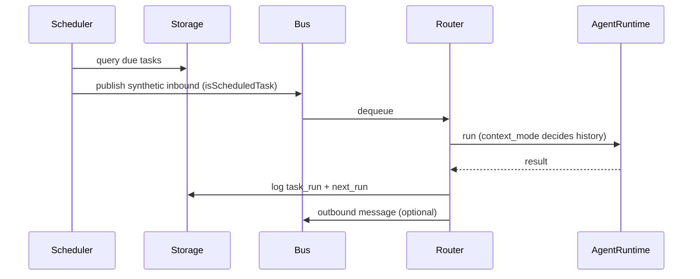

# Corebot Architecture

> A lightweight yet capable TypeScript bot architecture, inspired by NanoClaw + NanoBot patterns.
> Goals: **single-process**, **plug-in extensions (Tools/MCP/Skills)**, **multi-channel ready**, **safe-by-default**, and **evolvable**.

---

## 1) Design Goals

- **Powerful**: Multi-channel adapters, tool calling, skills, memory, scheduler, MCP integrations.
- **Lightweight**: Minimal dependencies, single Node.js process, no distributed components by default.
- **Safe-by-default**: Workspace sandbox for files, optional shell allowlist, and isolated process execution for high-risk tools.
- **Extensible**: Tools from built-ins, MCP servers, and Skills (prompt plugins).
- **Operable**: Structured logs, SQLite persistence, health endpoints, and runtime metrics/SLO alerts.

---

## 2) High-Level Architecture



---

## 3) Core Data Types

- **InboundMessage**: `{channel, chatId, senderId, content, metadata}`
- **OutboundMessage**: reply payload for channels
- **ConversationKey**: `${channel}:${chatId}` for per-chat serialization
- **Session State**: conversation summary + enabled skills + last compact time
- **Tool**: schema-defined callable function
- **Skill**: prompt plugin (SKILL.md + metadata)
- **Task**: `cron|interval|once` + `context_mode` (`group|isolated`)

---

## 4) Message Bus and Routing

### 4.1 MessageBus
- Async queue for inbound/outbound messages.
- Simple, single-process, low overhead.
- Idempotent publish by message id (duplicates collapse to the same queue record).
- Backpressure controls (queue caps, overload backoff) and per-chat rate limits.

### 4.2 ConversationRouter
- **Per-conversation serialization**: avoid concurrent message context races.
- Loads chat record from storage, builds context, runs agent, stores messages and summaries.
- Writes scheduled task run logs when applicable.
- Uses inbound execution ledger + deterministic message/outbound IDs to make re-processing idempotent.

---

## 5) ContextBuilder

ContextBuilder assembles a system prompt and runtime messages from:

1) **Identity / Policy**: `workspace/IDENTITY.md`, `workspace/TOOLS.md`
2) **User Profile**: `workspace/USER.md`
3) **Memory**: `workspace/memory/MEMORY.md` + per-chat memory
4) **Skills Index**: list of skills with name + description
5) **Always Skills**: always-loaded skills embedded in the system prompt
6) **Conversation Summary**: compacted summary when available
7) **Recent History**: last N messages (configurable)

### Per-Chat Memory
- **Global memory**: `workspace/memory/MEMORY.md` — shared across all chats.
- **Chat memory**: `workspace/memory/{channel}_{chatId}.md` — scoped to a specific chat.
- Both are included in the system prompt when available, except isolated scheduled-task runs (chat memory excluded).

### Conversation Compaction
- When stored message count exceeds `historyMaxMessages * 2`, compaction triggers.
- The LLM generates a bullet summary of recent messages (max 150 words).
- Old messages beyond `historyMaxMessages` are pruned from storage.
- The summary is stored in `conversation_state` and included in future system prompts.

### Progressive Skill Loading
- System prompt includes only a **skills index**.
- Detailed skill content is read by tool call (`skills.read`) when needed.

---

## 6) Agent Runtime

### 6.1 Provider Abstraction
OpenAI-compatible provider is implemented first; other providers can be added later.

```ts
export interface LlmProvider {
  chat(req: {
    model: string;
    messages: ChatMessage[];
    tools?: ToolDefinition[];
    temperature?: number;
  }): Promise<{ content?: string; toolCalls?: ToolCall[] }>;
}
```

### 6.2 Tool-Calling Loop
- Max tool iterations (`maxToolIterations`, default 8).
- Each tool call executed via `ToolRegistry.execute()`.
- High-risk tools can run in a dedicated isolated worker process (`isolation` config).
  - Isolatable built-ins: `shell.exec` (default), `web.fetch`, `fs.write` (opt-in via `isolation.toolNames`).
- Tool output size capped (`maxToolOutputChars`).
- Returns final response or a fallback if tool loop exhausts.

---

## 7) ToolRegistry

Unifies three tool sources:

1) **Built-in Tools**: TS functions with Zod validation.
2) **MCP Tools**: discovered dynamically from MCP servers.
3) **Skill Tools**: (optional) if a skill provides additional tools.

### Built-ins Included
- **fs.read / fs.write / fs.list**
- **shell.exec** (off by default; allowlist optional)
- **web.fetch / web.search** (Brave Search API)
- **memory.read / memory.write**
- **message.send / chat.register / chat.set_role**
- **tasks.schedule / tasks.list / tasks.update**
- **skills.list / skills.read / skills.enable / skills.disable / skills.enabled**
- **mcp.reload** (admin only)
- **bus.dead_letter.list / bus.dead_letter.replay** (admin only)

---

## 8) MCP Integration

### 8.1 MCP Client
- Reads `.mcp.json`
- Connects to each server (stdio or SSE URL)
- Uses MCP `tools/list` to register tool schemas
- Calls `tools/call` when tool is invoked
- Applies server/tool allowlists before registration.
- Validates `.mcp.json` against strict schema (server naming + command/url exclusivity).
- Re-syncs config dynamically during inbound processing (no restart required).
- Reload applies atomically; invalid config keeps last-known-good MCP tool bindings.
- Auto-sync retries use exponential backoff and open-circuit cooldown after repeated failures.
- Reload outcomes are observable via telemetry metrics and `audit_events`.

### 8.2 MCP Server (Future)
> Not yet implemented. A future extension may expose Corebot's own capabilities
> (message sending, scheduler, memory, admin ops) as an MCP server for external clients.

---

## 9) Skills

### 9.1 Skill File Structure
```
skills/
  web-research/
    SKILL.md
```

Each skill is a single `SKILL.md` file with YAML frontmatter and markdown body.
The loader discovers skills by scanning `workspace/skills/*/SKILL.md`.

### 9.2 Frontmatter Example
```markdown
---
name: web-research
description: "Web search + citation formatting"
always: false
requires:
  - env: ["BRAVE_API_KEY"]
tools:
  - web.search
  - web.fetch
---
```

### 9.3 Loading Strategy
- List skills and provide index in system prompt.
- Read skill body on demand using `skills.read` tool.
- Always-skills are embedded in system prompt at startup.

---

## 10) Scheduler

Supports:
- **cron** expressions
- **interval** (ms)
- **once** (ISO datetime)

Task execution modes:
- **group**: include chat context
- **isolated**: minimal context (self-contained tasks)

Scheduler ticks on configurable interval and emits synthetic inbound messages.
Retries after downstream failures stay idempotent through inbound execution ledger + deterministic IDs.
Task run logs are recorded in `task_runs`.

---

## 11) Storage

SQLite schema (minimal but sufficient):



### Storage Strategy
- Full message storage only for **registered chats** or if `storeFullMessages=true`.
- Always store assistant + tool outputs.
- Conversation compaction runs when message count grows beyond threshold.
- Pre-migration backups + migration history enable rollback on schema failures.
- Tool execution audit trail is persisted in `audit_events`.

---

## 12) Security Boundaries

### 12.1 Workspace Sandbox
- All file operations (`fs.read`, `fs.write`, `fs.list`) are restricted to `workspace/`.
- Path traversal attempts outside workspace are rejected by `resolveWorkspacePath()`.

### 12.2 Role-Based Policy Engine
The `DefaultToolPolicyEngine` enforces the following rules:

| Tool | Normal User | Admin |
|------|-------------|-------|
| `shell.exec` | Denied | Allowed (if `allowShell=true`) |
| `fs.write` to protected paths | Denied | Allowed |
| `memory.write` (global scope) | Denied | Allowed |
| `message.send` (cross-chat) | Denied | Allowed |
| `chat.register` (other chats) | Denied | Allowed |
| `chat.set_role` | Denied | Allowed |
| `tasks.update` (other chats) | Denied | Allowed |
| `mcp.reload` | Denied | Allowed |
| `bus.dead_letter.*` | Denied | Allowed |
| `mcp__*` (all MCP tools) | Denied | Allowed |
| `web.fetch` | Domain/port policy checked | Domain/port policy checked |

**Protected workspace paths** (non-admin `fs.write` denied): `IDENTITY.md`, `TOOLS.md`, `USER.md`, `.mcp.json`, `skills/`.

### 12.3 Admin Bootstrap
- First admin is created via `chat.register` with `role=admin` and a `bootstrapKey`.
- The key must match `adminBootstrapKey` in config.
- Single-use mode: key is invalidated after first successful use.
- Lockout: after `adminBootstrapMaxAttempts` failures, bootstrap is locked for `adminBootstrapLockoutMinutes`.
- Once an admin exists, new admins can only be granted by existing admins via `chat.set_role`.

### 12.4 Shell Execution
- Disabled by default (`allowShell=false`).
- Optional allowlist of executable names (`allowedShellCommands`).
- Commands are tokenized and executed directly (no shell interpreter), preventing injection.

### 12.5 Web Policies
- `allowedWebDomains`: restrict `web.fetch` to specific hosts.
- `allowedWebPorts` / `blockedWebPorts`: port-level allow/deny controls.
- Only `http://` and `https://` protocols are permitted.

### 12.6 Environment Filtering
- `web.search` reads env keys only from `allowedEnv` (for example `BRAVE_API_KEY`).
- Isolated shell workers inherit only system PATH + explicitly allowed keys.
- Non-isolated `shell.exec` inherits process env when shell execution is enabled.

### 12.7 MCP Allowlists
- `allowedMcpServers`: when non-empty, only listed servers are connected (empty means allow all).
- `allowedMcpTools`: when non-empty, only matching tools are registered (supports `*` wildcard patterns; empty means allow all).

### 12.8 Isolation Bulkhead + Circuit Breaker
- High-risk tools (`shell.exec`, `web.fetch`, `fs.write`) can run in isolated worker processes.
- Worker concurrency cap (`maxConcurrentWorkers`, default 4).
- Per-tool circuit breaker: opens after N consecutive failures, resets after cooldown.

### 12.9 Audit Trail
- All tool executions are recorded in `audit_events` (success, denied, error, invalid_args).
- Sensitive argument keys (`key`, `token`, `secret`, `password`, `authorization`, `cookie`) are redacted.

### 12.10 Output Truncation
- Tool output is capped at `maxToolOutputChars` (default 50,000) to prevent prompt inflation.

---

## 13) Repo Layout

```
corebot/
  package.json
  tsconfig.json
  Dockerfile
  ARCHITECTURE.md
  RUNBOOK.md
  src/
    main.ts              # Entry point, signal handling
    app.ts               # CorebotApp class, lifecycle management
    bin.ts               # CLI handler (--help, --version)
    index.ts             # SDK exports
    types.ts             # Core type definitions
    config/
      schema.ts          # Zod config schema
      load.ts            # Load config from file + env
    bus/
      bus.ts             # MessageBus: durable queue, backpressure, rate limits
      queue.ts           # AsyncQueue<T> (in-memory signal queue)
      router.ts          # ConversationRouter: per-chat serialization
    channels/
      base.ts            # Channel interface
      cli.ts             # CLI channel (readline)
      webhook.ts         # HTTP webhook channel (inbound POST + outbound GET)
      whatsapp.ts        # WhatsApp adapter (stub)
      telegram.ts        # Telegram adapter (stub)
    agent/
      runtime.ts         # AgentRuntime + OpenAICompatibleProvider
      context.ts         # ContextBuilder (system prompt assembly)
      compact.ts         # Conversation compaction via LLM summarization
    tools/
      registry.ts        # ToolRegistry: register, execute, audit
      policy.ts          # DefaultToolPolicyEngine (role-based auth)
      web-guard.ts       # Domain/port allowlist validation
      web-fetch-core.ts  # Shared fetch helpers
      builtins/
        index.ts         # Export all built-in tools
        fs.ts            # fs.read, fs.write, fs.list
        shell.ts         # shell.exec
        web.ts           # web.fetch, web.search
        memory.ts        # memory.read, memory.write
        message.ts       # message.send, chat.register, chat.set_role
        tasks.ts         # tasks.schedule, tasks.list, tasks.update
        skills.ts        # skills.list, skills.read, skills.enable, skills.disable, skills.enabled
        mcp.ts           # mcp.reload
        bus.ts           # bus.dead_letter.list, bus.dead_letter.replay
    mcp/
      manager.ts         # MCP client: connect, discover, call
      config.ts          # MCP config schema + parser
      allowlist.ts       # Server/tool allowlist enforcement
      types.ts           # MCP configuration types
    skills/
      loader.ts          # Discover and parse SKILL.md files
      types.ts           # SkillIndexEntry, SkillMeta
    storage/
      sqlite.ts          # SQLite storage (WAL, migrations, CRUD)
      migrations.ts      # Schema migrations v1–v6
    scheduler/
      scheduler.ts       # Task scheduler (tick + emit)
      utils.ts           # computeNextRun (cron/interval/once)
    isolation/
      runtime.ts         # IsolatedToolRuntime: worker pool, circuit breaker
      worker-process.ts  # Isolated worker script
    observability/
      logger.ts          # Pino structured JSON logger
      telemetry.ts       # RuntimeTelemetry: metrics counters
      metrics.ts         # Prometheus-format metrics endpoint
      server.ts          # ObservabilityServer: HTTP /health /metrics /status
      slo.ts             # SloMonitor: threshold alerts
    util/
      ids.ts             # newId() (nanoid)
      time.ts            # nowIso(), sleep()
      file.ts            # resolveWorkspacePath()
  scripts/
    db-backup.ts         # Database backup script
    db-restore.ts        # Database restore script
    smoke-package.ts     # Release smoke test
  test/
    *.test.ts            # 19 test files (unit + integration + e2e)
  workspace/
    IDENTITY.md
    USER.md
    TOOLS.md
    memory/
      MEMORY.md
    skills/
      corebot-help/SKILL.md
```

---

## 14) Execution Flow (Sequence)

### 14.1 Standard Message Flow


### 14.2 Scheduled Task Flow


---

## 15) Configuration

`config.json` or environment variables. See `README.md` for the full reference.

Key config areas: provider, bus (queue/retry/rate-limit), observability, SLO, isolation, security (shell/web/MCP allowlists), MCP sync backoff/circuit (`mcpSync`), admin bootstrap, webhook, CLI.

---

## 16) Implementation Status (Repo)

- ✅ CLI channel
- ✅ Webhook channel (inbound POST + outbound GET)
- ✅ Agent runtime with tool-calling loop
- ✅ Built-in tools (9 tool modules)
- ✅ Role-based tool policy engine (admin/normal)
- ✅ SQLite storage + conversation state + task runs
- ✅ Durable message queue with idempotent publish, retry, and dead-letter
- ✅ Inbound execution ledger for re-processing idempotency
- ✅ Bus backpressure + per-chat rate limiting
- ✅ Scheduler (cron/interval/once)
- ✅ Skills index + progressive loading + hot-reload
- ✅ MCP client tool injection + hot-reload
- ✅ Isolated tool runtime with worker pool + circuit breaker
- ✅ Observability (Prometheus metrics, health endpoints, SLO monitor)
- ✅ Persistent audit events for tool execution
- ✅ Migration safety with pre-migration backups
- ⏳ WhatsApp/Telegram adapters (stubs only)
- ⏳ Optional container isolation

---

## 17) Future Extensions

- Container sandbox for shell + tool execution
- Additional LLM providers (Anthropic/OpenRouter)
- WhatsApp and Telegram channel adapters
- MCP server mode (expose Corebot capabilities to external clients)
- Multi-instance coordination and queue partitioning

---

## 18) Quick Start

```bash
pnpm install --frozen-lockfile
export OPENAI_API_KEY=YOUR_KEY
pnpm run dev
```

Type into the CLI prompt to interact with Corebot.

---

## 19) Package Manager and Reproducible Build Policy

- Standardize on `pnpm` only (pinned via `packageManager` in `package.json`).
- Commit and review both `pnpm-lock.yaml` and `pnpm-workspace.yaml`.
- Use `pnpm install --frozen-lockfile` in local reproducible runs, CI, and Docker.
- Maintain explicit build-script approvals through `pnpm-workspace.yaml` (`onlyBuiltDependencies`).
- For new native/build-script dependencies, run `pnpm approve-builds` and commit policy updates together with lockfile changes.

---

If you want this document tailored to a specific deployment (multi-channel, container mode, MCP servers list), provide requirements and I will update the architecture section accordingly.
