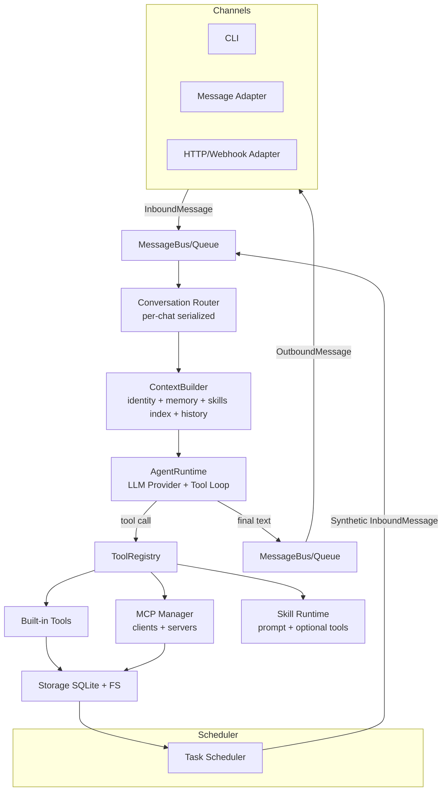
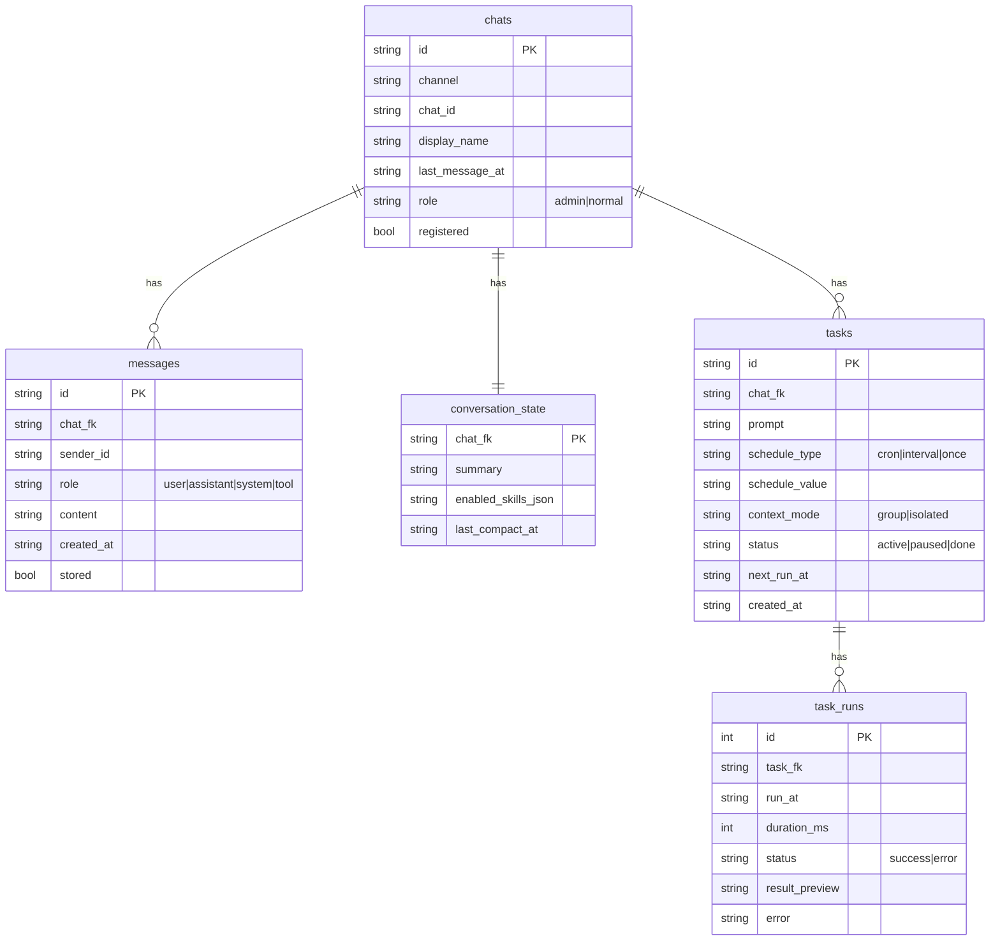
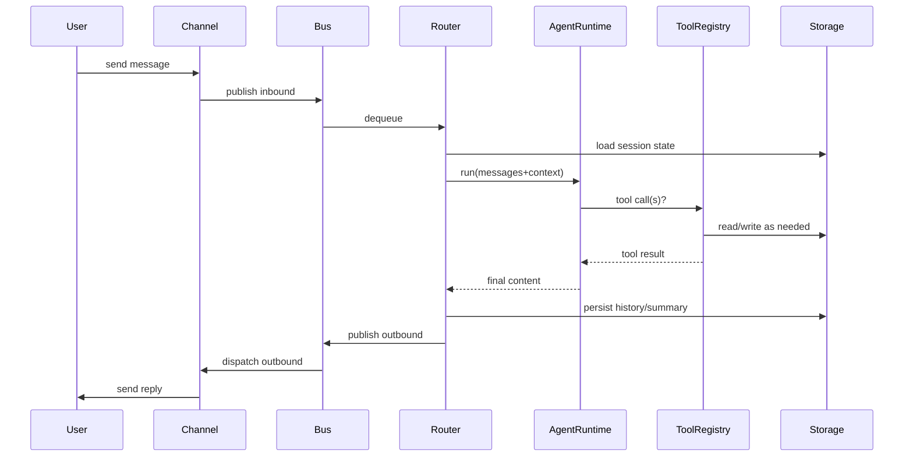
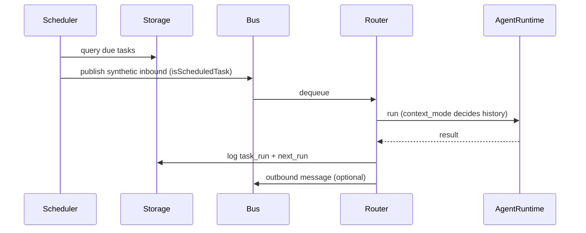

# Corebot Architecture

> A lightweight yet capable TypeScript bot architecture, inspired by NanoClaw + NanoBot patterns.
> Goals: **single-process**, **plug-in extensions (Tools/MCP/Skills)**, **multi-channel ready**, **safe-by-default**, and **evolvable**.

---

## 1) Design Goals

- **Powerful**: Multi-channel adapters, tool calling, skills, memory, scheduler, MCP integrations.
- **Lightweight**: Minimal dependencies, single Node.js process, no distributed components by default.
- **Safe-by-default**: Workspace sandbox for files, optional shell allowlist, and isolated process execution for high-risk tools.
- **Extensible**: Tools from built-ins, MCP servers, and Skills (prompt plugins).
- **Operable**: Structured logs, local SQLite storage, task run logs.

---

## 2) High-Level Architecture



---

## 3) Core Data Types

- **InboundMessage**: `{channel, chatId, senderId, content, metadata}`
- **OutboundMessage**: reply payload for channels
- **ConversationKey**: `${channel}:${chatId}` for per-chat serialization
- **Session State**: conversation summary + enabled skills + last compact time
- **Tool**: schema-defined callable function
- **Skill**: prompt plugin (SKILL.md + metadata)
- **Task**: `cron|interval|once` + `context_mode` (`group|isolated`)

---

## 4) Message Bus and Routing

### 4.1 MessageBus
- Async queue for inbound/outbound messages.
- Simple, single-process, low overhead.

### 4.2 ConversationRouter
- **Per-conversation serialization**: avoid concurrent message context races.
- Loads chat record from storage, builds context, runs agent, stores messages and summaries.
- Writes scheduled task run logs when applicable.

---

## 5) ContextBuilder

ContextBuilder assembles a system prompt and runtime messages from:

1) **Identity / Policy**: `workspace/IDENTITY.md`, `workspace/TOOLS.md`
2) **User Profile**: `workspace/USER.md`
3) **Memory**: `workspace/memory/MEMORY.md` + per-chat memory
4) **Skills Index**: list of skills with name + description
5) **Always Skills**: always-loaded skills embedded in the system prompt
6) **Conversation Summary**: compacted summary when available
7) **Recent History**: last N messages (configurable)

### Progressive Skill Loading
- System prompt includes only a **skills index**.
- Detailed skill content is read by tool call (`skills.read`) when needed.

---

## 6) Agent Runtime

### 6.1 Provider Abstraction
OpenAI-compatible provider is implemented first; other providers can be added later.

```ts
export interface LlmProvider {
  chat(req: {
    model: string;
    messages: ChatMessage[];
    tools?: ToolDefinition[];
    temperature?: number;
  }): Promise<{ content?: string; toolCalls?: ToolCall[] }>;
}
```

### 6.2 Tool-Calling Loop
- Max tool iterations (`maxToolIterations`, default 8).
- Each tool call executed via `ToolRegistry.execute()`.
- High-risk tools can run in a dedicated isolated worker process (`isolation` config).
  - Current isolated built-ins: `shell.exec`, `web.fetch`, `fs.write`.
- Tool output size capped (`maxToolOutputChars`).
- Returns final response or a fallback if tool loop exhausts.

---

## 7) ToolRegistry

Unifies three tool sources:

1) **Built-in Tools**: TS functions with Zod validation.
2) **MCP Tools**: discovered dynamically from MCP servers.
3) **Skill Tools**: (optional) if a skill provides additional tools.

### Built-ins Included
- **fs.read / fs.write / fs.list**
- **shell.exec** (off by default; allowlist optional)
- **web.fetch / web.search** (Brave Search API)
- **memory.read / memory.write**
- **message.send / chat.register / chat.set_role**
- **tasks.schedule / tasks.list / tasks.update**
- **skills.list / skills.read**

---

## 8) MCP Integration

### 8.1 MCP Client
- Reads `.mcp.json`
- Connects to each server (stdio or SSE URL)
- Uses MCP `tools/list` to register tool schemas
- Calls `tools/call` when tool is invoked

### 8.2 MCP Server (Optional)
- Can expose host capabilities (message sending, scheduler, memory, admin ops)
- Single-process can implement these directly
- Container mode can bridge via IPC

---

## 9) Skills

### 9.1 Skill File Structure
```
skills/
  web-research/
    SKILL.md
    tools.ts        # optional
    mcp.json        # optional
```

### 9.2 Frontmatter Example
```markdown
---
name: web-research
description: "Web search + citation formatting"
always: false
requires:
  - env: ["BRAVE_API_KEY"]
tools:
  - web.search
  - web.fetch
---
```

### 9.3 Loading Strategy
- List skills and provide index in system prompt.
- Read skill body on demand using `skills.read` tool.
- Always-skills are embedded in system prompt at startup.

---

## 10) Scheduler

Supports:
- **cron** expressions
- **interval** (ms)
- **once** (ISO datetime)

Task execution modes:
- **group**: include chat context
- **isolated**: minimal context (self-contained tasks)

Scheduler ticks on configurable interval and emits synthetic inbound messages.
Task run logs are recorded in `task_runs`.

---

## 11) Storage

SQLite schema (minimal but sufficient):



### Storage Strategy
- Full message storage only for **registered chats** or if `storeFullMessages=true`.
- Always store assistant + tool outputs.
- Conversation compaction runs when message count grows beyond threshold.

---

## 12) Security Boundaries

- **Workspace sandbox** for file access.
- **Shell execution** disabled by default (allowlist optional).
- **Env filtering**: only allowlisted env vars available to tools.
- **Policy guardrails**: non-admin `fs.write` cannot modify protected paths (`skills/`, `IDENTITY.md`, `TOOLS.md`, `USER.md`, `.mcp.json`).
- **Tool output truncation** to avoid large prompts/logs.

Optional container isolation can be added later for stronger protection.

---

## 13) Repo Layout

```
corebot/
  package.json
  tsconfig.json
  src/
    main.ts
    config/
      schema.ts
      load.ts
    bus/
      bus.ts
      queue.ts
      router.ts
    channels/
      base.ts
      cli.ts
      whatsapp.ts
      telegram.ts
      webhook.ts
    agent/
      runtime.ts
      context.ts
      compact.ts
    tools/
      registry.ts
      builtins/
        fs.ts
        shell.ts
        web.ts
        memory.ts
        message.ts
        tasks.ts
        skills.ts
    mcp/
      manager.ts
      types.ts
    skills/
      loader.ts
      types.ts
    storage/
      sqlite.ts
      migrations.ts
    scheduler/
      scheduler.ts
      utils.ts
    observability/
      logger.ts
    util/
      ids.ts
      time.ts
      file.ts
  workspace/
    IDENTITY.md
    USER.md
    TOOLS.md
    memory/
      MEMORY.md
    skills/
      ...
```

---

## 14) Execution Flow (Sequence)

### 14.1 Standard Message Flow


### 14.2 Scheduled Task Flow


---

## 15) Configuration

`config.json` or environment variables:

- `OPENAI_API_KEY`, `OPENAI_BASE_URL`, `OPENAI_MODEL`
- `COREBOT_SQLITE_PATH`, `COREBOT_WORKSPACE`
- `COREBOT_ALLOW_SHELL` + `COREBOT_SHELL_ALLOWLIST`
- `COREBOT_ALLOWED_ENV`
- `COREBOT_ISOLATION_ENABLED`, `COREBOT_ISOLATION_TOOLS`
- `COREBOT_ISOLATION_WORKER_TIMEOUT_MS`, `COREBOT_ISOLATION_MAX_WORKER_OUTPUT_CHARS`
  - `COREBOT_ISOLATION_TOOLS` can include `shell.exec`, `web.fetch`, `fs.write`.
- `COREBOT_HISTORY_MAX`, `COREBOT_MAX_TOOL_ITER`
- `COREBOT_MCP_CONFIG`

---

## 16) Implementation Status (Repo)

- ✅ CLI channel
- ✅ Agent runtime with tool loop
- ✅ Built-in tools
- ✅ SQLite storage + conversation state + task runs
- ✅ Scheduler (cron/interval/once)
- ✅ Skills index + progressive loading
- ✅ MCP client tool injection
- ⏳ WhatsApp/Telegram/Webhook adapters (stubs only)
- ⏳ Optional container isolation

---

## 17) Future Extensions

- Container sandbox for shell + tool execution
- Additional providers (Anthropic/OpenRouter)
- Multi-channel adapters
- Fine-grained permission system
- Observability hooks (metrics + tracing)

---

## 18) Quick Start

```bash
pnpm install --frozen-lockfile
export OPENAI_API_KEY=YOUR_KEY
pnpm run dev
```

Type into the CLI prompt to interact with Corebot.

---

## 19) Package Manager and Reproducible Build Policy

- Standardize on `pnpm` only (pinned via `packageManager` in `package.json`).
- Commit and review both `pnpm-lock.yaml` and `pnpm-workspace.yaml`.
- Use `pnpm install --frozen-lockfile` in local reproducible runs, CI, and Docker.
- Maintain explicit build-script approvals through `pnpm-workspace.yaml` (`onlyBuiltDependencies`).
- For new native/build-script dependencies, run `pnpm approve-builds` and commit policy updates together with lockfile changes.

---

If you want this document tailored to a specific deployment (multi-channel, container mode, MCP servers list), provide requirements and I will update the architecture section accordingly.
